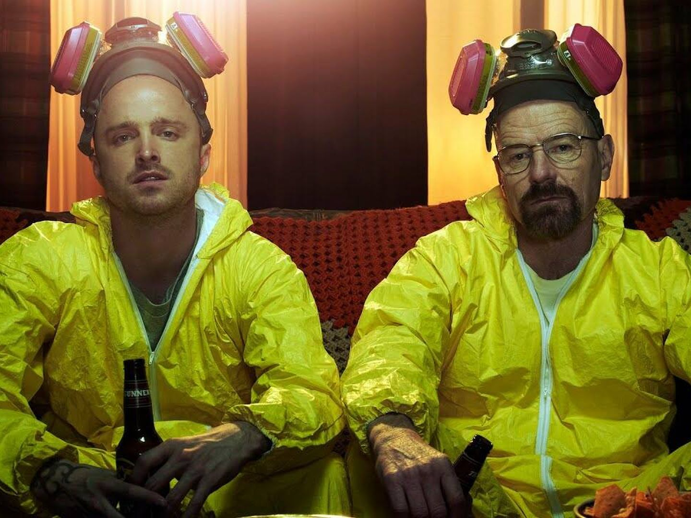

## Breaking Bad.

**Breaking Bad es una serie de televisión estadounidense creada y producida por Vince Gilligan. Narra la historia de Walter White (Bryan Cranston), un profesor de química con problemas económicos a quien le diagnostican un cáncer de pulmón inoperable. Para pagar su tratamiento y asegurar el futuro económico de su familia, comienza a cocinar y vender metanfetamina4​ junto con Jesse Pinkman (Aaron Paul), un antiguo alumno suyo. La serie, ambientada y producida en Albuquerque (Nuevo México), se caracteriza por sus escenarios desérticos y por la tendencia en la historia de poner a sus personajes en situaciones que aparentemente no tienen salida, lo que llevó a que su creador la describa como un wéstern contemporáneo.5​**

